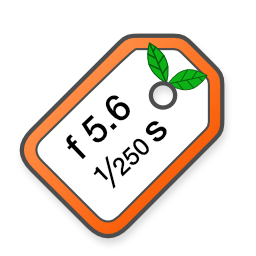

+++
title = "Yafra Tagger"
date =  2023-05-11T17:53:48+02:00
draft = false
image = "yafra-tagger.png"
+++

## Tag your digitized analog film

### Add EXIF data to your digitized analog film

[Privacy Policy]()

Yafra-Tagger is the companion app for [Yafra](/yafra). It reads Yafra files and writes data to your digitized film. 

### Getting started{#help}
Export your films from Yafra to you mac (select a film from the film list and share it using AirDrop, Mail or Save to Files). Open Yafra-Tagger and drag a film to the left panel. Then drag digitized film images to the right panel. Supported file types are
- jpeg
- tiff
- heic
- png

Assign exposures to images by dragging them from the left panel to the right panel. You can assign the same exposure to multiple images. If you accidentally assign a wrong exposure, simply replace it by dragging the correct one to the image.

Swipe left to remove an image from the list

#### Using Adobe Lightroom Classic?
There are two scenarios:
###### Tag images before import into Lightroom
Tag your images as described above. Import them into Lightroom. If the catalog is structured by date, the images should be imported according to their new capture date instead of the date they were digitized.
###### Tag images after import into Lightroom
In Lightroom, select on or more images that you want to tag, choose Photo/Show in Finder (cmd-R). Tag the image(s) in Yafra-Tagger, go back to Lightroom Classic and select Metadata/Read Metadata from File. Now Lightroom will use the updated data.

### Roadmap
- Support more file formats
- Rotate images in the image list
- Add File menu